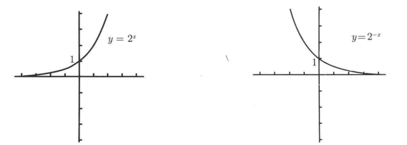

# 函数、图像和直线

### 函数、定义域、值域和垂线检验 

**函数**是将一个对象转化为另一个对象的规则。起始对象称为输入，来自称为**定义域**的集合。返回对象称为输出，来自称为**值域**的集合。

**一个函数必须给每一个有效的输入指定唯一一个输出。**

三种常见的定义域判别情况：

* 分数的分母不能为0
* 不能取一个负数的平方根（四次、六次根等等）
* 不能取一个负数或0的对数

由于函数必须是一个x，唯一的y与之对应，因此可以通过**垂线检验**，如果函数图像在垂线上有多于1个交点，则它不是函数。

### 反函数和水平线检验 

给定一个函数f，在f的值域中选择y，在理想的情况下仅有一个x值满足$$f(x)=y$$​。如果对于值域中的每一个y都成立，就可以定义个新的函数，从y出发，仅有一个x满足$$f(x)=y$$，则新的函数记为**反函数**，写作​$$f^{-1}$$。

根据反函数的性质，每一个y都只有一个x与它对应，可以沿着函数图像做**水平线检验**，如果交点超过1个，则函数没有反函数。

求反函数只需要尝试解出x，改写成y即可。

函数与反函数关于$$y=x$$**对称**。

.png>)

思考：为什么函数与反函数存在对称性，本质原因是**坐标轴进行旋转**。

### 函数的复合 

复合函数比较简单，没啥好记录的，就是$$f(g(x))$$​

$$y=x^{x^x}$$应该看做​​$$y=x^{(x^{x})}$$而不是\
$$y=(x^x)^x$$，因为后者等价于$$y=x^{x^2}$$。​

### 奇函数与偶函数 

**奇函数**：$$f(-x)=-f(x)$$​

**偶函数**：$$f(-x)=f(x)$$​

前提条件：**定义域要关于原点对称**，否则是非奇非偶函数。

$$f(x)=0$$​既是奇函数，又是偶函数。

奇函数在图像上关于原点对称，偶函数关于Y轴对称。

 (1).png>)

### 线性函数与多项式、有理函数、指数函数、对数函数图像 

#### 线性函数

斜截式：$$f(x)=mx+b$$​

m为**斜率**，m的**绝对值越大**，直线越陡（可以想象为上山下山）

 (1) (1).png>)

b为y轴的**截距**。

m>0，函数单增；m<0，函数单减。

.png>)

点斜式：$$y-y_0=m(x-x_0)$$​

两点求斜率：$$\frac{y_2-y_1}{x_2-x_1}$$​

#### 幂函数

.png>)

对于幂函数来说，奇次幂之间的图像很相似，偶次幂之间的图像很相似。

#### 多项式函数

多项式的一般形式：$$p(x)=a_nx^n+a_{n-1}x^{n-1}+\cdots+a_1x+a_0$$

所以多项式的图像两端取决于高次幂的图像：

.png>)

#### 有理函数

有理函数的定义：$$\frac{p(x)}{q(x)}$$​（p,q为多项式函数）

有理函数本身变化多样，以下是p为1的情况：

 (1).png>)

#### 指数函数与对数函数​

指数函数y轴截距为1，**当a>1时单增，a<1时单减**（a>0）

**指数函数与对数函数互为反函数**

****.png>)****

### 如何处理绝对值 

绝对值函数图像，可以将原函数图像基于x轴上翻得到：

.png>)
